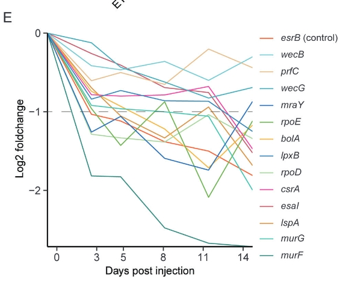

# CLEF

## 引言

格兰氏阴性病原体有多种效果蛋白，比如 ：
- *Salmonella&Citrobacter* 分泌的T3SE在细胞内形成稳定的毒性网络来影响宿主的免疫系统，
- *Legionella pneumonia* 分泌的T4SE会进入噬菌体从而建立稳定重复的生活，
- *Vibrio cholerae* 分泌的T6SE能够杀死周围的病原体并利用宿主的免疫系统反应来促进寄生。

因此，识别并描述细菌的效果蛋白很重要。

效果蛋白研究使用传统方法耗时耗力，机器学习方法很有效，如：
- Bastion3使用PSSM来预测T3SE，
- CNN-T4SE使用CNN并利用PSSM来预测T4SE，
- T3SEpp和EP3集成了基因和启动子的特征来识别T3SE。

现在已知的效果蛋白很少，而且很多效果蛋白的序列和结构差别很大，数据集太小导致模型预测效果差。PLM使用transformer来输出蛋白质表达，能有效捕捉蛋白质的进化和序列信息。

- T4SEfinder集成PLM和PSSM特征，是T4SE预测的SOTA
- DeepSecE使用PLM+分类器

除了PLM从氨基酸序列生成的蛋白质表达外，蛋白质的结构、人为注释等也能为效果蛋白的预测提供有效信息。CLEF集成生物学特征和PLM表达，并通过对比学习捕获跨模态相关性。
## Model Architecture

### 对比学习模块

- 融合的信息：ESM表达 & 生物学特征
- ESM2(33 * transformer): 输入蛋白质序列，输出1280维 embedding
- 限定了蛋白质最大输入序列为256
- ESM2的参数在训练过程中是冻结的，不进行微调

- Encoder A: 2层transformer，输入ESM蛋白质表示，输出encoder表示，之后根据氨基酸序列长度平均后得到跨模态表示，再经过MLP处理变为128维 embedding
- Encoder B: MLP,输入生物学特征，输出128维embedding，当多个蛋白质模态被输入时，这些模态特征首先会被归一化，然后在处理之前被串联起来。

### 模型训练

- 对比学习阶段：CLEF输入模态特征和ESM表达并得到跨模态表达
- 效果蛋白预测阶段：分类器网络在有标签的数据集上训练

## Dataset

### 具体介绍

<figure>

<figcaption>本文所使用的数据集列表</figcaption>

</figure>

- S1 对比学习阶段预训练数据集 （10831无标签蛋白质序列）包含3Di, AT, DPC-PSSM, MSA, fasta
- S2 效果蛋白训练集 （[GitHub:DeepSecE](https://github.com/zhangyumeng1sjtu/DeepSecE)的训练集 ）
- S3 效果蛋白测试集 （[GitHub:DeepSecE](https://github.com/zhangyumeng1sjtu/DeepSecE)的测试集）
- S4 representation聚类测试集 （S3 中的148个蛋白质结构，聚类标签通过[Foldseek](https://github.com/steineggerlab/foldseek)生成，使用AlphaFold数据库（AFDB）中对应的预测结构作为输入）
- S5 不同论文中的训练集
- S6 用于产生蛋白质embedding（预测效果蛋白相互作用）的训练集

训练集包括1577个非效应子蛋白、128个I型分泌蛋白（T1SEs）、68个II型分泌蛋白（T2SEs）、406个III型分泌蛋白（T3SEs）、504个IV型分泌蛋白（T4SEs）以及232个VI型分泌蛋白（T6SEs）。测试集则包含150个非效应子蛋白、20个T1SEs、10个T2SEs、30个T3SEs、30个T4SEs和20个T6SEs。

### 数据集构建

为了增强训练数据集的多样性，从 UniProt 中随机抽取了 4,000 个经过审核的蛋白质，并从 VFDB 中抽取了 1,000 个与毒性相关的蛋白质。为了去除冗余序列，使用 MMseqs 软件，以超过 70% 的序列相似性阈值和 80% 的匹配区域对蛋白质进行聚类。最终数据集包含 10,831 个蛋白质。

除了蛋白质序列外，还收集了各种模态数据用于特征生成。

- 通过 UniProt 的访问编号从 AFDB 和 UniProt 中检索结构 PDB 文件和注释文本文件。
- 对于未列入 UniProt 的蛋白质，通过使用 MMseqs 对 UniRef50 进行相似性搜索，匹配同源标识符，为了进一步优化数据集的序列多样性，采用50%的序列相似性阈值进行筛选。通过ClustalO进行多序列比对（MSA）以及利用PSI-BLAST生成位置特异性计分矩阵（PSSM）数据，这些操作均在预训练数据集内完成。

## Featurization and model inputs

<figure>

<figcaption>输入到CLEF的特征</figcaption>

</figure>

### 描述

- **DPC-PSSM** 使用[POSSUM](https://academic.oup.com/bioinformatics/article/33/17/2756/3813283)工具中[BLASTp](https://blast.ncbi.nlm.nih.gov/Blast.cgi?CLIENT=web&DATABASE=nr&NCBI_GI=on&PAGE=Proteins&PROGRAM=blastp&QUERY=IDQILETNRIACRFNHSNQKYAFSITFQEECAHVTLVVYGRNLHKHFFYWKLHKQLIDLIANPNDMFFF&END_OF_HTTPGET=Y)算法对训练集进行[PSSM](https://cs.rice.edu/~ogilvie/comp571/pssm/)搜索得到的进化序列信息，*Basic Local Alignment Search Tool用于将用户提供的蛋白质序列与已知的蛋白质数据库进行比对，以寻找相似的蛋白质序列，从而推断出未知序列的功能、结构以及可能的进化关系*
- **MSA** 由msa-transformer生成的MSA表示，MSA使用[ClustalOmega](https://www.ebi.ac.uk/jdispatcher/msa/clustalo)通过MMseqs聚类生成，*Clustal Omega 是一种用于蛋白质和 DNA/RNA 的通用多序列比对工具*
- **3Di** 使用[Foldseek](https://search.foldseek.com/search)通过3Di-alphabet(将蛋白质三维结构简化为一维序列的编码系统)生成，序列通过[ProstT5](https://github.com/mheinzinger/ProstT5)编码，预测的结构通过AFDB下载，*ProstT5是一种基于ProtT5-XL-U50的蛋白质语言模型，能够将蛋白质的三维结构转换为一维的3Di标记序列*
- **Annotations-Text** 通过[BioBERT](https://academic.oup.com/bioinformatics/article/36/4/1234/5566506)生成的蛋白质文本注释，*使用生物学语料库预训练并微调后的BERT*
- **Secretion Embedding** 通过[DeepSecE](https://github.com/zhangyumeng1sjtu/DeepSecE)输出的embedding，反映不同类型分泌蛋白的特征，*DeepSecE 是ESM-1B+Transformer+Linear Softmax，用于预测革兰氏阴性细菌中的多类分泌效应蛋白*
- **RNAseq** 转录组数据的实验特征，反映基因表达水平的差异
- **ECP** 细胞外蛋白质组数据的实验特征，反映蛋白质丰度的差异
- **Tnseq** Tn-seq数据的实验特征，反映基因突变对病原体适应性的影响

### 特征整合

#### 多模态数据

- 在数据集<mark>S3</mark>中，原始ESM2表示难以区分不同类型效应子，通过[UMAP](https://umap-learn.readthedocs.io/en/latest/)降维后，不同类别样本未能有效分离
- 将蛋白质序列输入DeepSecE后得到分泌嵌入，在输入SE特征并经过对比学习后，CLEF输出的表示能够形成明显聚类。聚类性能显著提高
- 将UniProt中的蛋白质注释和Gene Ontology(GO)注释编码为注释文本特征，通过BioBERT进行编码，并与ESM2表示进行对比训练后，CLEF能够从注释文本中捕获关键信息，聚类性能显著提高
- 将蛋白质的空间信息使用Foldseek转化为结构标记序列，并通过预训练模型ProstT5进行编码。在测试集<mark>S4</mark>中，CLEF表示在聚类性能上优于ESM2和3Di特征

#### 实验数据

除了普通的蛋白质以外，从 *E.piscicida* 实验中收集了 RNAseq, ECP, Tnseq，共选择了同时存在于Tnseq和RNAseq数据集中的2517个条目，其中879种蛋白质在ECP数据中有对应的特征。对于缺乏ECP数据的蛋白质，使用所有维度均设为0的向量作为占位符。

#### RNAseq (8 dimension)

RNAseq包括**esrB基因缺失突变体** *（抑制T3SS表达）* 和**野生型**在**DMEM** *（诱导T3SS表达）* 及**LB**培养基 *（常用的细菌培养基）* 中的转录组谱 *（细胞中所有mRNA 的合集及其表达水平的分布。通过RNA-seq技术，可以全面分析细胞在不同条件下的基因表达情况）* ，反映了与T3SS相关的差异表达基因。

将两种RNA在两种培养条件下的差异表示为8维向量：

$$
 \mathbf{f}^{\text{RNAseq}} = \left[ \textbf{Diff}_{\text{ LB,DMEM}}^{\text{ esrB}},\textbf{Diff}_{\text{ LB,DMEM}}^{\text{ wt}},\textbf{Diff}_{\text{ wt,esrB}}^{\text{ DMEM}},\textbf{Diff}_{\text{ wt,esrB}}^{\text{ LB}} \right] \quad (1) $$ 

其中，Diff 表示转录组数据中定义的读取差异，分别代表了基因和培养基对于结果的影响，定义为：

 $$ \textbf{Diff}_{\, i,j}^{\, k} = \left[ {log}_{2} \left( \frac{{rpkm}_{ik}}{{rpkm}_{jk}} \right), -{log}_{10} \left(p_{ij}^{k}\right) \right] \quad (2) $$ 

其中：
- ${rpkm}_{ik}$  表示在条件  $ik$  下特定基因的每千碱基百万读取数RPKM
- $p_{ij}^{k}$  表示在条件  $ik$  和  $jk$  下RPKM的显著性 $p$ 值，例如  $p^{\text{ wt}}_{\text{ LB,DMEM}}$  表示在LB培养基和DMEM中培养的野生型（WT）的读取差异的显著性。

#### ECP (3 dimension)
ECP表示野生型（WT）、T3SS 突变体（$\Delta$T3SS）和 T3/T6SS 突变体（$\Delta$T3/T6SS）的细胞外蛋白组成的差异。蛋白质组学数据包括通过质谱在指定菌株培养上清液中检测到的 1,295 种蛋白质的相对丰度。

构建 3 维向量，显示菌株间蛋白质丰度的倍数变化(这里$q$的下标小写是为了美观)：

$$
f^{\text{ECP}} = \left( \frac{lf_{q_\text{t3ss}}}{lf_{q_\text{wt}}}, \frac{lf_{q_{\text{t3/t6ss}}}}{lf_{q_{\text{wt}}}}, \frac{lf_{q_{\text{t3/t6ss}}}}{lf_{q_{\text{t3ss}}}} \right) \quad (3)
$$

其中， $lf_{q_i}$  表示菌株  $i$  的 ECP 样本中特定蛋白质的无标记定量值。

#### Tnseq (3 dimension)

Tnseq反映了在活体寄生过程中基因随时间的贡献。时间特征是通过条件必需性模式分析（PACE *一种用于分析基因在不同条件下对表型贡献的方法。通过模式分析来识别基因在特定条件下的必需性，从而评估基因在体内定植过程中的动态变化*）生成的

整合为一个3维向量：
$$
\mathbf{f}^{\text{Tnseq}} = \left[ \text{coefficient}_a, \text{coefficient}_b, \text{coefficient}_c \right] \quad (4)
$$
其中， $\text{coefficient}_a$  $\text{coefficient}_b$  和  $\text{coefficient}_c$  分别表示拟合到时间必需性数据的多项式函数的二次项、一次项和常数项系数。

## 模型训练
### 对比学习
#### Loss Function
在对比训练阶段，两个编码器在未标记的预训练数据集（Dataset S1）上进行训练。使用信息噪声对比估计（InfoNCE）计算从输入蛋白质序列和模态特征编码得到的跨模态嵌入  $ z $  和  $ z' $  之间的损失：

 $$
\mathcal{L}_{\text{InfoNCE}} = -\frac{1}{N} \sum_{i=1}^{N} \log \frac{\exp(\text{sim}(z_i, z'_{i+})/\tau)}{\sum_{j=1}^{N} \exp(\text{sim}(z_i, z'_{j})/\tau)} \quad (5)
$$ 

其中：
-  $\text{sim}(\cdot)$  表示余弦相似度
-  $N$ 是 batchsize 
-  $z'_{i+}$  表示蛋白质  $i$  的正样本
-  $\tau$  是 Temperature 

#### Hyperparameter

    lr = 2e-5 # Adam
    epoch = 20
    batch_size = 128
    dropout_attention = 0.05 
    dropout_feedforward = 0.45

### 分类预测

#### Loss Function
分类预测模型是在标记过的数据集（Dataset S2）上进行训练的。二元交叉熵（BCE）作为损失函数：

 $$
L_{\text{BCE}} = -\frac{1}{N} \sum_{i=1}^{N} \left[ y_i \log(\hat{y}_i) + (1 - y_i) \log(1 - \hat{y}_i) \right] \quad (6)
$$ 

其中：
-  $\hat{y}_i$  和  $y_i$  分别表示输入蛋白质的预测标签和真实标签。
-  $N$  是 batch size

#### Hyperparameter

    lr = 7.5e-6 # Adam
    epoch_max = 65
    dropout = 0.5
    early_stop_patience = 10

## 模型评估

### 聚类评估指标

#### NMI
Normalized Mutual Information，用于衡量两个聚类结果之间的相似性,取值范围为[0,1]，值越接近1表示聚类结果与真实标签之间的相关性越高，计算公式如下：

$$
NMI \left( A,B\right)=\frac{2*I\left( A,B\right)}{H(A)+H(B)}
$$
其中，$H$代表熵，计算公式如下：
$$
H(A)= - \sum p_a\log(p_a)
$$
其中，$I$代表互信息，计算公式如下：
$$
I(A,B)=H(A)-H(A|B)
$$

#### ARI

Adjusted Rand Index,用于评估聚类结果与真实标签之间的相似性，取值范围为[-1,1]，值越大表明聚类结果与真实标签越一致，0表示相似性不如随机分类，计算公式如下：
$$
ARI=\frac{RI-E(RI)}{1-E(RI)}
$$
其中，$RI$ 代表原始的Rand Index，计算公式如下：
$$
RI=\frac{TP+TN}{TP+TN+FP+FN}
$$
其中，$E(RI)$ 代表对于RI的期望，计算公式如下：
$$
E(RI)=\frac{\Sigma_i\binom{a_i}{2} * \Sigma_j\binom{b_j}{2}}{\Sigma_j\binom{N}{2}}
$$
其中，$N$代表总样本数，$a_i$代表$A$结果中的第$i$个聚类簇，$b_i$代表$B$结果中的第$j$个聚类簇

#### ASW
Average Silhouette Width，用于衡量样本与其所属类簇的紧密程度以及与相邻类簇的分离程度。取值范围[-1, 1]，计算公式如下：

$$
s(i) = \frac{b(i) - a(i)}{\max\{a(i), b(i)\}}
$$

其中：
- $a(i)$ 表示样本 $i$ 与其所属类簇中其他样本的平均距离，反映了样本 $i$ 在其所属类簇中的紧密程度。
- $b(i)$ 表示样本 $i$ 与其最近的其他类簇中样本的平均距离，反映了样本 $i$ 与相邻类簇的分离程度。

最终的平均轮廓系数 $ASW$ 为所有样本轮廓系数 $s(i)$ 的平均值：

$$
ASW = \frac{1}{n} \sum_{i=1}^{n} s(i)
$$

其中，$n$ 为样本总数。

### 分类评估指标

## 结果

### CLEF improves effector prediction task

- **方法**： 将 DP、MSA、3Di、AT 与 ESM2 表示结合(共15种)，训练下游二分类网络，数据集<mark>S2</mark>分为训练集：1341分泌基底和1577无效应的蛋白，测试集：260个蛋白
- **结果**：
    - **T3SE 预测**：CLEF-DP/AT 表现最佳。

    - **T4SE 预测**： CLEF-DP/MSA/3Di/AT 表现最佳。

    - **T6SE 预测**： CLEF-DP/MSA/3Di/AT 性能最佳

    - **稳健性评估**：five-fold cross-validation，15 种 CLEF 表示在不同模态组合下表现一致。
- **与其他模态特征比较**：
  - ESM2 在三个预测任务中整体性能优于其他单独模态特征。
  - AT 特征在T4SE表现优异(ACC 0.985)，但是在T6SE（缺少注释）表现较差。
  - 多重的多模态表示比ESM2和单一表示效果更好。

- **结论**：CLEF 能显著提升模型在 T3SE、T4SE 和 T6SE（最佳） 预测任务中的性能

每个box的中间线表示中位数值，箱子的上边缘和下边缘分别表示3/4（Q3）和1/4（Q1），异常值点显示了显著偏离的结果

### SOTA: CLEF-based effector predictor

- **目的**： 将 CLEF 与 SOTA 预测模型进行比较。

- **方法**：使用独立测试集（数据集<mark> S3</mark>）进行性能比较，包含 2 个多类预测器（BastionX47 和 DeepsecE35）和 6 个二元分类模型（Bastion324、T3SEpp26、Bastion448、T4SEfinder37、T4SEpp36 和 Bastion649）。

- **结果**：

| 预测任务  | 模型名称           |   ACC  |   F1  |   MCC  |
|:---------|:------------------|------:|-----:|------:|
| T3SE     | CLEF-DP/AT        |  0.989| 0.951|  0.944|
| T3SE     | DeepSecE          |  0.965| 0.861|  0.845|
| T4SE     | CLEF-DP/MSA/3Di/AT|  0.992| 0.966|  0.962|
| T4SE     | DeepSecE          |  0.977| 0.906|  0.895|
| T6SE     | CLEF-DP           |  1.000| 1.000|  1.000|
| T6SE     | DeepSecE          |  0.981| 0.872|  0.862|

- **结论**：基于 CLEF 的分泌效应子预测器在 T3SE、T4SE 和 T6SE 预测任务中均达到了SOTA，且在多效果蛋白预测中能保持较低的FP率。

### Ablation study

- 较短的输入序列（128个氨基酸）有助于提高T3SE预测的性能，这可能是因为T3SE的N端分泌信号对其预测有重要作用；而较长的输入序列（512个氨基酸）在T4/T6SE预测中表现更好，因为这些效应子的决定性基序多位于中间或C端。因此，将256个氨基酸的长度设置为最大输入长度，以平衡不同任务的性能。

- 用简单的MLP替换CLEF编码器模块中的Transformer块时，虽然训练时间缩短，但整体性能略有下降。这表明Transformer在捕获跨模态特征方面更为高效。

- 通过生成非重叠的预训练数据集来评估CLEF的泛化能力，结果表明，尽管改进幅度有所降低，但CLEF的跨模态表示仍能增强性能，显示出其预训练过程在处理更新样本时具有一定的泛化能力。

- 将CLEF框架应用于其他已知的预训练语言模型（PLM）时，虽然基于ESM2的模型表现最佳，但CLEF能够提高其他PLM的性能，显示出一定的泛化能力。这表明CLEF可以有效地与各种PLM集成，用于更广泛的蛋白质分类任务。

### CLEF assists discovering T3SE T6SE

- 利用 CLEF 为肠出血性大肠杆菌、鼠伤寒沙门氏菌和 E. piscicida  等重要的肠致病菌生成了预测的 T3SE 集合，其中在大肠杆菌和鼠伤寒沙门氏菌中，CLEF 成功识别了大部分已验证的 T3SE 同源物，显示出较强的性能。对于E. piscicida由于数据本身有限，只验证了12个中的9个。

- 使用了 6 种不同的跨模态表示来构建模型：CLEF-DP、CLEF-MSA、CLEF-3Di、CLEF-AT、CLEF-DP/AT 和baseline ESM2，用于 T3SE 预测。对于 T6SE 预测，CLEF-DP/AT 被替换为在 T6SE 基准测试中表现更好的 CLEF-DP/MSA/3Di/AT。通过对每个候选蛋白在分类器中的平均预测分数进行排名，从 E. piscicida  基因组中筛选并验证了 15 个潜在效果蛋白，包括 9 个 T3SE 和 6 个 T6SE

- 通过 Western blot（WB利用抗原-抗体特异性结合来检测目标蛋白质）和腺苷酸环化酶（CyaA能测出在 T3SS 存在的情况下在 RAW264.7 细胞内的有效转位特征）测定法进行验证，8 个预测的 T3SE 显示出依赖 T3SS 的分泌特征，5 个预测的 T6SE 显示出依赖T6SS的分泌特征。 预测的T3SS（ETAE_1138）和 T6SS（ETAE_1151）在 WB 测定中未能在上清液中被检测到，这可能是因为分泌水平较低，或者分泌仅在感染期间发生。

  - kD 是蛋白质分子量的单位，表示千道尔顿，是质量单位，用于表示原子和分子的质量。
  - 条带的位置反映了蛋白质的分子量。通常，分子量较大的蛋白质会迁移到凝胶的上清液，而分子量较小的蛋白质会迁移到凝胶的沉淀物。
  - 条带的强度（深浅）反映了蛋白质的表达水平。条带越深，说明蛋白质的表达量越高。
  - FLAG 在野生型（WT）、T3SS 缺陷型（ΔeseBCD）和 T6SS 缺陷型（ΔevpAB）的上清液和沉淀物中进行免疫印迹，野生型（WT）：用于验证在正常情况下，目标效应子是否能够被分泌到上清液中。如果在 WT 的上清液中检测到 FLAG 标签的蛋白，说明该效应子能够正常分泌。T3SS 缺陷型（ΔeseBCD）：用于验证目标效应子是否依赖 T3SS 进行分泌。如果在 T3SS 缺陷型的上清液中检测不到 FLAG 标签的蛋白，但在 WT 中可以检测到，说明该效应子的分泌依赖 T3SS。T6SS 缺陷型（ΔevpAB）：用于验证目标效应子是否依赖 T6SS 进行分泌。如果在 T6SS 缺陷型的上清液中检测不到 FLAG 标签的蛋白，但在 WT 中可以检测到，说明该效应子的分泌依赖 T6SS。FLAG 标签是一种短的多肽序列（通常为 DYKDDDDK），可以特异性地与抗 FLAG 抗体结合。通过在目标蛋白上添加 FLAG 标签，可以方便地使用抗 FLAG 抗体进行免疫印迹（Western blot），从而检测目标蛋白的存在和表达水平。
  - RpoA 非效应蛋白，作为阴性对照
  - EseB 已知的 T3SE 蛋白，作为阳性对照
  - EvpP 已知的 T6SE 蛋白，作为阳性对照

RAW264.7巨噬细胞被野生型（WT）、ΔeseBCD和ΔevpAB菌株感染，这些菌株携带表达候选蛋白的pUTt载体，候选蛋白在C末端融合了cyaA基因。通过ELISA定量检测感染RAW264.7巨噬细胞的细胞内cAMP浓度，从而反映效应子转位到宿主细胞的水平。CyaA测定结果以平均值±标准差（n=3，每次实验2个技术重复）表示，P基于单尾学生t检验。

### Contrastive training with experimental data enhances the effector predictions

利用基于转座子插入测序（Tn-seq）的宿主定殖适应性分析、EsrB 调控的转录组数据（RNA-seq）和细胞外蛋白质组（ECP）数据，生成反映每个基因相应特征的特征。这些特征被作为模态特征输入到 CLEF 中，生成了三种跨模态表示：CLEF-Tnseq、CLEF-RNAseq 和 CLEF-ECP，以及整合了所有实验特征的多模态表示 CLEF-EXP。

通过 Western blot（WB）和 CyaA 测定法又鉴定出 8 种效果蛋白，包括 3 种 T3SE（ETAE_1009（TomB）、ETAE_1640 和 ETAE_2677）和 5 种 T6SE（ETAE_0256、ETAE_1612、ETAE_3090、ETAE_3082 和 ETAE_0047）

### CLEF illustrates effector-effector interactions

利用 CLEF 来学习相互作用蛋白之间的关联，使用来自 Dockground 数据库的 34985 种蛋白，将相互作用的配对作为正样本。交叉验证显示，训练后的蛋白表示能够区分相互作用蛋白和非相互作用蛋白。验证发现，9 对先前验证的配对中有 8 对具有高相似性分数，而大多数非相互作用的配对则具有低分数

CLEF-EEI 被用来预测 30 种 E. piscicida  T3SS 蛋白之间的相互作用，并且进一步对相似性分数进行缩放以提高对蛋白配对之间区分度。使用 AlphaFold 365 来验证预测的相互作用。预测的复合物 YfiD-EsaM、EscA-EseH、ETAE_0053-EseK 和 EseE-EscE 在预测的对齐误差图的反对角区域显示出相当低的误差，这表明对蛋白配对之间的接触界面具有很高的置信度

### CLEF+PACE uncovers in vivo virulence determinants 
PACE是一种分析细菌动态变化过程中基因重要性的方法。PACE分数低代表基因在被插入突变破坏时，病原体的定殖能力显著减弱。计算已知的毒性基因与目标基因/蛋白质的余弦相似度，即CLEF分数。在散点图中，设置CLEF和PACE的阈值，发现CLEF分数高且PACE分数低的病毒集中在右下角。这个簇中包含了重要的毒力调控因子T3SS/T6SS相关基因，说明CLEF评分可以用检测毒性。

右下角簇中共有387个基因，其中87个是已通过PACE验证的毒性基因，还有300个是通过CLEF检测出的。将这些基因用KEGG（京都基因与基因组百科全书）分析并绘制成网络图，其中边代表有相互作用，发现在这300个基因能够根据功能划分成不同组别。

E. piscicida以1感染复数（MOI）=10 被毒性感染后6小时，细胞内嗜水气单胞菌变体的菌落形成单位（CFU）被标准化到细胞数量，以确定细菌的增殖能力。实验结果表明，多个基因的突变体在巨噬细胞感染实验中表现出定殖能力的显著减弱

CRISPRi-seq时间序列曲线显示感染后选定基因的读取丰度变化，证实了某些基因对嗜水气单胞菌在宿主体内定殖能力的重要性。

## Dataset Appendix

### [Paper:DeepSecE](https://pmc.ncbi.nlm.nih.gov/articles/PMC10599158/pdf/research.0258.pdf)

革兰氏阴性菌是常见的初始致病菌，它们利用多种复杂的纳米机器，包括I型、II型、III型、IV型和VI型分泌系统，将毒性因子传递到细胞外组织空间和/或靶细胞中。不同类型的分泌系统具有不同的底物分泌机制，并招募具有特定序列模式的分泌蛋白。这些分泌蛋白一旦转移到宿主细胞内，就可能影响细胞功能和/或破坏信号通路。

一些工具能够识别不同类型的分泌蛋白，包括I型分泌蛋白（T1SEs）、III型分泌蛋白（T3SEs）、IV型分泌蛋白（T4SEs）和VI型分泌蛋白（T6SEs）。

- 基于位置特异性计分矩阵（PSSM）的方法，如Bastion3、CNN-T4SE和Bastion6，通常能够取得较好的预测性能。PSSM能够有效地从蛋白质序列中捕获进化信息，但搜索相似序列所需的计算时间过长，使得这种方法不适合用于大规模预测细菌分泌蛋白。目前的大多数方法，如CNN-T4SE和Bastion6，能够预测单一类型的分泌蛋白，但由于不同分泌系统的分泌信号和序列模式存在显著差异，它们无法对所有类型进行分类。
- 基于特征的统计框架PREFFECTOR是第一个用于预测革兰氏阴性菌中I型至VI型多种分泌系统的分泌蛋白的方法；尽管这种方法能够区分分泌底物和非分泌蛋白，但它无法可靠地将蛋白质分配到特定的分泌系统。EffectiveDB建立并整合了用于预测III型、IV型和VI型分泌蛋白的方法，并将其纳入一个统一的网络资源中，BastionHub也可以预测I型和II型蛋白。这两种方法都依赖于二元分类模型的组合，因此无法精确识别分泌蛋白并根据分泌系统类型对其进行分类。
- 利用预训练的蛋白质语言模型的优势来训练我们称之为分泌（效应子）蛋白的深度学习框架（DeepSecE）的深度神经网络，以识别约3000个蛋白质序列数据集中所代表的5种主要类型的分泌底物（T1SE至T4SE以及T6SE）。这个深度学习模型不仅达到了包括Bastion3、T4SEfinder和Bastion6在内的最先进的分类器的性能水平，还能够进行全基因组范围内的分泌蛋白推断，从而进一步揭示革兰氏阴性菌的分泌系统。DeepSecE将有助于发现新型分泌蛋白，并使其在细菌疾病发病机制中的功能研究成为可能。<mark>LLM翻译后整理</mark>

### 5种不同的分泌系统介绍

- **I型分泌系统**（Type I Secretion System, T1SS）

  - 定义：I型分泌系统是一种由三个主要组分组成的蛋白质复合体，能够直接将蛋白质从细胞质分泌到细胞外环境中。
  - 机制：包括一个细胞质膜中的外排 ATP 酶（如 HlyB）、一个膜融合蛋白（如 HlyD）和一个外膜通道蛋白（如 HlyA）。这种系统通过 ATP 水解提供能量，将底物直接分泌到细胞外。
  - 应用：主要用于分泌毒性因子（如溶血素）和一些降解酶（如蛋白酶、核酸酶等），帮助细菌在宿主环境中生存和繁殖。
  - 特点：分泌的蛋白质通常具有信号肽，但信号肽在分泌过程中会被切除。分泌过程不需要中间的周质空间停留。
- **II型分泌系统**（Type II Secretion System, T2SS）

  - 定义：II型分泌系统是一种多组分的蛋白质复合体，能够将蛋白质从细胞质分泌到细胞外环境中。
  - 机制：通过一系列膜蛋白和周质蛋白的协同作用，将蛋白质从细胞质运输到周质空间，然后再分泌到细胞外。这个过程需要多个组分的协同作用，包括外膜通道蛋白、膜融合蛋白和细胞质膜中的 ATP 酶。
  - 应用：主要用于分泌一些大型的酶类（如纤维素酶、淀粉酶等）和毒性因子，帮助细菌在宿主环境中获取营养和逃避宿主免疫系统。
  - 特点：分泌的蛋白质通常具有信号肽，信号肽在进入周质空间后被切除。分泌过程相对复杂，涉及多个步骤和组分。
- **III型分泌系统**（Type III Secretion System, T3SS）

  - 定义：III型分泌系统是一种复杂的蛋白质分泌机器，能够将蛋白质直接注入宿主细胞的细胞质中。
  - 机制：通过一个类似于注射器的结构，将效应蛋白直接注入宿主细胞。这个系统由多个膜蛋白和周质蛋白组成，能够形成一个跨膜通道。
  - 应用：主要用于病原菌的致病过程，能够将效应蛋白直接注入宿主细胞，干扰宿主的信号通路和免疫反应。例如，鼠伤寒沙门氏菌和志贺氏菌利用 T3SS 注入效应蛋白，从而逃避宿主的免疫系统并引起疾病。
  - 特点：分泌的蛋白质通常没有信号肽，因为它们是通过 T3SS 直接注入宿主细胞的。分泌过程高度特异，能够识别和分泌特定的效应蛋白。
- **IV型分泌系统**（Type IV Secretion System, T4SS）

  - 定义：IV型分泌系统是一种多功能的蛋白质分泌机器，能够将蛋白质和核酸从细菌细胞分泌到细胞外环境或直接注入宿主细胞。
  - 机制：由多个膜蛋白和周质蛋白组成，能够形成一个复杂的分泌通道。T4SS 可以通过两种方式分泌物质：一种是将蛋白质分泌到细胞外环境，另一种是将蛋白质或核酸直接注入宿主细胞。
  - 应用：主要用于病原菌的致病过程，能够将效应蛋白和核酸（如质粒）直接注入宿主细胞，从而改变宿主细胞的生理状态。例如，嗜肺军团菌利用 T4SS 注入数百种效应蛋白，从而在宿主细胞内生存和繁殖。
  - 特点：分泌的蛋白质通常没有信号肽，因为它们是通过 T4SS 直接注入宿主细胞的。分泌过程高度复杂，能够分泌多种类型的底物。
- **VI型分泌系统**（Type VI Secretion System, T6SS）

  - 定义：VI型分泌系统是一种相对较新的分泌系统，能够将蛋白质直接注入宿主细胞或邻近的细菌细胞。
  - 机制：通过一个类似于收缩注射系统的结构，将效应蛋白直接注入目标细胞。这个系统由多个膜蛋白和周质蛋白组成，能够形成一个复杂的分泌通道。
  - 应用：主要用于病原菌的致病过程和细菌之间的竞争。例如，铜绿假单胞菌利用 T6SS 注入毒性蛋白，从而杀死邻近的细菌并获取营养。
  - 特点：分泌的蛋白质通常没有信号肽，因为它们是通过 T6SS 直接注入目标细胞的。分泌过程高度特异，能够识别和分泌特定的效应蛋白。<mark>来自LLM</mark>

### 数据集来源介绍

- [UniProtKB](https://www.uniprot.org/help/uniprotkb):

是一个集中的蛋白质功能信息资源库，提供准确、一致且丰富的注释。它记录了每个条目的核心数据（如氨基酸序列、蛋白质名称、分类信息和引用信息），并添加了大量注释信息，包括生物学本体论、分类和交叉引用，以及注释质量的证据来源。UniProtKB分为两部分：Swiss-Prot经过审核的手动注释部分，信息来自文献和专家评估; TrEMBL未经审核的自动注释部分，等待进一步手动注释。<mark>来自官网</mark>

- [VFDB](https://www.mgc.ac.cn/VFs/)

是一个全面且用户友好的数据库，旨在为研究人员提供各种医学重要细菌病原体的致病因子（VFs）信息。用户可以通过浏览属名或输入关键词进行搜索，并使用BLAST工具比对所有已知的致病因子相关基因。VFDB为存储、检索和更新细菌致病因子信息提供了统一的平台。<mark>来自官网</mark>
